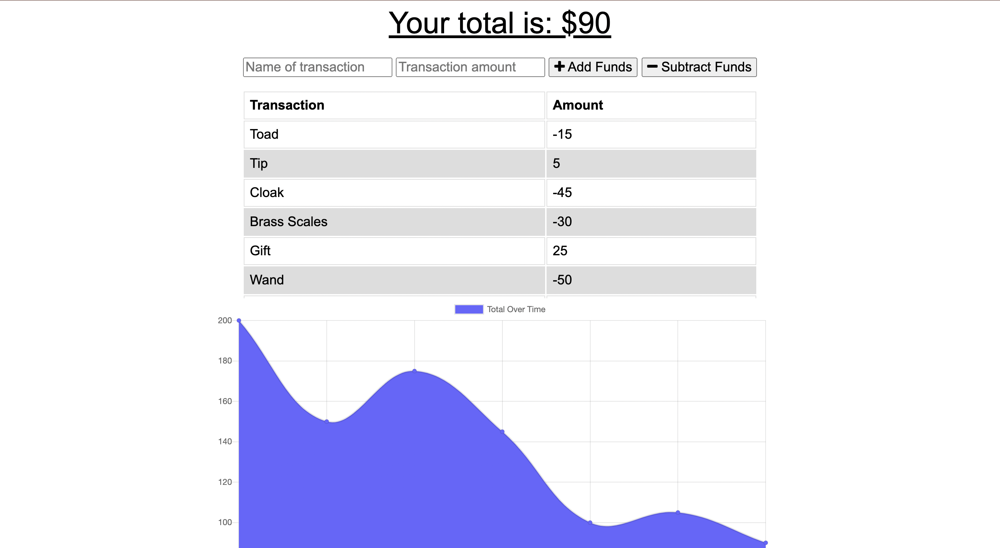
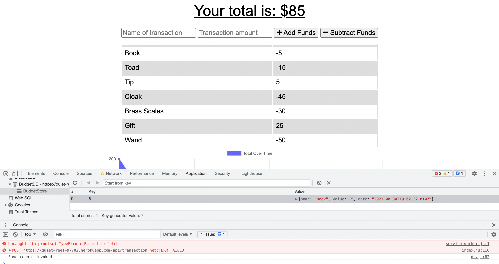

# BudgetTracker

 

## Description

This application provides a budget tracker where users can keep track of their deposits and expenses. It saves and displays users' expenses and deposits in a table and graph — and has offline capability, so that none of the entries will be lost.

The offline capability functions with Webpack and Babel.

## Table of Contents

- [Installation](#installation)
- [Usage](#usage)
- [License](#license)
- [Credits](#credits)
- [Questions](#questions)

## Installation

To use this application, navigate to the deployed Heroku [site](https://quiet-reef-97702.herokuapp.com/).

To install this application locally yourself, download and clone the files from this repository. Run 'npm install' to install the packages in the package.json (and in a second package.json in the _public_ folder).

The server can be started in the command-line by running 'npm start,' and the application can be viewed on your local browser at _localhost_.

## Usage

If you use the application through the deployed [Heroku site](https://quiet-reef-97702.herokuapp.com/), simply navigate to and interact with the site from there. Add deposits and expenses and keep track of your budget with the table and graph. With its offline capabilities, the app will function the same way if you happen to go offline.

If the program was cloned, downloaded, and installed instead, get the application running by typing "npm start" into the command-line. All features of the application are then accessible through _localhost_ on your browser or other applications.

_Home: View Budget_

_Offline Capabilities_

## Credits

Starter code provided by the University of Minnesota Coding Bootcamp. Offline functionality added by me.

## License

This project is licensed under [MIT License](https://opensource.org/licenses/MIT).

## Questions

See more of my work on my [GitHub Profile](https://github.com/msteblu/).
For any additional questions, reach me at my email: megan@steblay.net.
